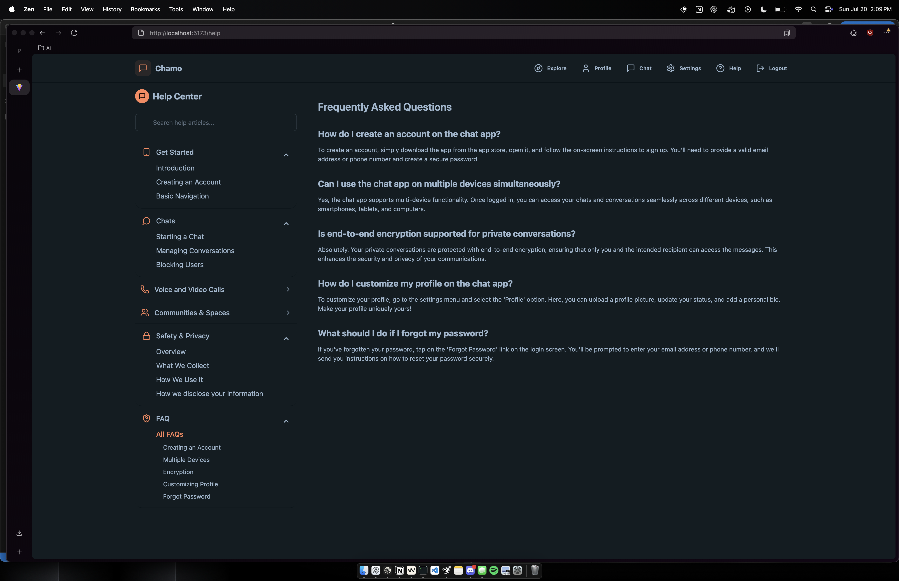

# Chamo v2 Application

A modern real-time chat application with private messaging, public rooms, and social features.

## Preface
This project is a revamp of my capstone project from 2024. I have taken out some features to make it more user-friendly and less complex. And also updated the UI to be more modern and user-friendly. I will have a demo for the app on linked here, and the new demo for this app here. The point of this revamp was to refresh my skills and reflect on the project from team and individual perspectives. I will be referring to the original project for some of the design, manual and documentation. These are also all available on GitHub on here with all our original documentations via PDF in this repository.

## Chamo v1 Original Demo Video


## Chamo v2 Demo Video


## Table of Contents

- [Overview](#overview)
- [Features](#features)
- [Architecture](#architecture)
- [Development Journey](#development-journey)
  - [Phase 1: Authentication & User Interface](#phase-1-authentication--user-interface)
  - [Phase 2: Messaging & Real-time Communication](#phase-2-messaging--real-time-communication)
  - [Phase 3: Chat Sessions & Friend Management](#phase-3-chat-sessions--friend-management)
  - [Phase 4: Public Rooms & Social Features](#phase-4-public-rooms--social-features)
  - [Phase 5: Refinement & Bug Fixes](#phase-5-refinement--bug-fixes)
- [Screenshots](#screenshots)
- [Demo](#demo)
- [Tech Stack](#tech-stack)
- [Installation](#installation)
- [Changelog](#changelog)

## Overview

Chamo is an anonymous chat application that allows users to communicate in real-time through both private messages and public chat rooms. The application supports user authentication, friend requests, random chat matching, and public room categorization.

## Features

- **User Authentication**: Secure login and registration system
- **Private Messaging**: One-on-one chat sessions with real-time updates
- **Public Chat Rooms**: Categorized public rooms for group discussions
- **Friend System**: Send, accept, and manage friend requests
- **Random Chat Matching**: Connect with random users for spontaneous conversations
- **User Blocking**: Block unwanted users from contacting you
- **User Reporting**: Report inappropriate behavior
- **Real-time Updates**: Instant message delivery using Socket.IO
- **Responsive Design**: Works on both desktop and mobile devices
- **Theme Support**: Light and dark mode options

## Architecture

### Backend

The backend is built with Node.js and Express, using MongoDB as the database. It follows a modular architecture with the following components:

- **Models**: Define the data structure for users, messages, chat sessions, and public rooms
- **Controllers**: Handle business logic for each feature
- **Routes**: Define API endpoints for client-server communication
- **Middleware**: Handle authentication, error handling, and socket connections
- **Socket.IO**: Manage real-time communication between clients

### Frontend

The frontend is built with React and uses a modern component-based architecture:

- **Components**: Reusable UI elements for consistent design
- **Pages**: Main application views (Home, Login, Signup, Explore, etc.)
- **Store**: State management using Zustand for global application state
- **Lib**: Utility functions and API client setup
- **Assets**: Static resources like images and icons

## Development Journey

The development of Chamo followed a structured approach, evolving from basic authentication to a full-featured social chat platform.

### Phase 1: Authentication & User Interface

The initial phase focused on setting up the project structure and implementing core authentication features:

1. **Project Setup**
   - Initialized the project repository
   - Set up the backend with Node.js, Express, and MongoDB
   - Created basic message routes and controllers
   - Implemented Tailwind CSS for frontend styling
   - Created page structure and navigation

2. **Authentication System**
   - Implemented signup functionality with account creation
   - Added login/logout functionality with proper session management
   - Created navbar with authentication controls
   - Developed profile modal for user information display

3. **User Profile & Theming**
   - Fixed profile picture upload and storage in database
   - Implemented theme system with multiple color schemes
   - Added "Chamo" color theme option
   - Completed settings page for user preferences

### Phase 2: Messaging & Real-time Communication

This phase focused on implementing the core messaging functionality and real-time updates:

1. **Chat UI Components**
   - Created sidebar component for navigation
   - Implemented chat header for conversation context
   - Designed message input UI with send button
   - Fixed message display and formatting issues

2. **Basic Messaging**
   - Implemented database storage for messages
   - Created API endpoints for sending and retrieving messages
   - Displayed chat conversations in the UI

3. **Real-time Communication**
   - Integrated Socket.IO for real-time chat functionality
   - Implemented user disconnect handling
   - Added online user tracking by mapping userIds to socketIds
   - Fixed UI issues with message input borders

4. **Enhanced Chat Experience**
   - Redesigned chat UI with improved message bubbles
   - Added image upload validation
   - Implemented online status indicators
   - Improved real-time message delivery and synchronization

### Phase 3: Chat Sessions & Friend Management

This phase focused on restructuring the chat system and adding social features:

1. **Chat Session Redesign**
   - Implemented chat session model for better organization
   - Added bidirectional chat matching functionality
   - Fixed Lucide icon imports for better UI consistency
   - Sorted messages in the sidebar by recency
   - Added mobile view support and fixed icon issues

2. **User Relationship Features**
   - Implemented user blocking functionality
   - Added chat deletion capability
   - Created help center and dropdown components
   - Fixed help center rendering issues
   - Completed help page implementation

3. **UI Refinements**
   - Fixed default checked states in settings
   - Disabled iOS and Android options (platform limitations)
   - Improved sign-in button visibility based on authentication state
   - Removed unnecessary delete icons

### Phase 4: Public Rooms & Social Features

This phase expanded the application with public chat rooms and enhanced social features:

1. **Public Room Foundation**
   - Created explore page frontend for room discovery
   - Updated color schemes for better visual hierarchy
   - Developed database models for public rooms
   - Implemented API endpoints for joining, leaving, and retrieving public rooms
   - Created controller for public room operations
   - Developed migration scripts for public room data

2. **Public Room Implementation**
   - Implemented public chat rooms with real-time messaging
   - Fixed sidebar chat session updates for real-time message display
   - Created participants panel showing online/offline status
   - Integrated participants panel into public room container
   - Standardized chat bubbles using DaisyUI components

3. **System Integration**
   - Added socket middleware to attach Socket.IO instance to requests
   - Created public room components and store for real-time messaging
   - Updated backend for public room messaging and socket integration
   - Enhanced frontend UI components for chat and explore pages
   - Updated authentication components for real-time messaging
   - Improved backend authentication and utility functions

### Phase 5: Refinement & Bug Fixes

The final phase focused on improving the user experience and fixing issues:

1. **UI/UX Improvements**
   - Restructured sidebar navigation with better button layout
   - Added divider lines between chat items for clarity
   - Fixed dropdown behavior for better interaction
   - Added friend request status tracking in ChatHeader
   - Improved friend request UI with compact icon buttons

2. **Bug Fixes & Optimizations**
   - Fixed message duplication in chat sessions by improving socket room handling
   - Enhanced friend request system for better persistence and status tracking
   - Updated store implementation to prevent message duplication
   - Improved UI responsiveness in chat components
   - Enhanced public room UI for better participant display
   - Updated backend controllers for improved user management
   - Enhanced user model to better support friend relationships
   - Created dedicated FriendRequestsPage for request management
   - Added migration scripts for username standardization
   - Developed socket utility module for better instance management
   - Removed unnecessary avatars in chat rooms
   - Fixed email display issues in the UI

## Screenshots

### Authentication & User Interface


### Chat Interface


### Public Rooms & Social Features


### Help & Settings





### Themes


## Demo

[Insert link to live demo or video demonstration]

## Tech Stack

### Backend
- **Node.js**: JavaScript runtime
- **Express**: Web framework
- **MongoDB**: NoSQL database
- **Mongoose**: MongoDB object modeling
- **Socket.IO**: Real-time communication
- **JWT**: Authentication
- **bcryptjs**: Password hashing
- **Cloudinary**: Image storage and management
- **dotenv**: Environment variable management
- **cors**: Cross-Origin Resource Sharing

### Frontend
- **React**: UI library
- **Vite**: Build tool
- **React Router**: Navigation
- **Zustand**: State management
- **Socket.IO Client**: Real-time communication
- **Axios**: HTTP client
- **TailwindCSS**: Utility-first CSS framework
- **DaisyUI**: UI component library
- **date-fns**: Date formatting
- **react-hot-toast**: Toast notifications
- **Lucide React**: Icon library

## Installation

### Prerequisites
- Node.js (v14 or higher)
- MongoDB
- npm or yarn

### Backend Setup
```bash
# Navigate to backend directory
cd backend

# Install dependencies
npm install

# Create .env file with the following variables
# MONGODB_URI=your_mongodb_connection_string
# JWT_SECRET=your_jwt_secret
# PORT=5001

# Start the server
npm run dev
```

### Frontend Setup
```bash
# Navigate to frontend directory
cd frontend

# Install dependencies
npm install

# Start the development server
npm run dev
```
